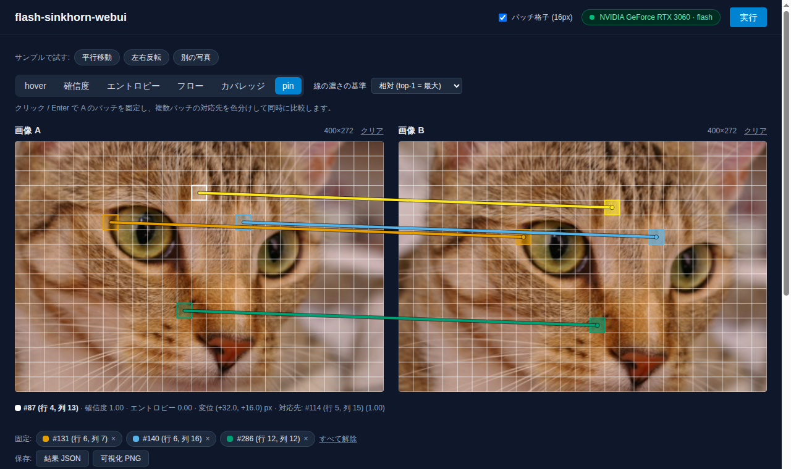

# flash-sinkhorn-webui

[English](README.md) | 日本語

2枚の画像をパッチに分割し、エントロピー正則化最適輸送 (Sinkhorn OT) でパッチ間の対応を求めてブラウザ上で可視化する Web アプリ。
OT ソルバには [flash-sinkhorn](https://pypi.org/project/flash-sinkhorn/) (PyTorch + Triton) を使う。
設計の詳細は [docs/SPEC.md](docs/SPEC.md)、開発の経緯は [docs/DEVLOG.md](docs/DEVLOG.md) にある。



## 必要環境

- Python 3.12 と [uv](https://docs.astral.sh/uv/)
- Node.js 20.19 以上 / 22.12 以上 (Vite 8 の要件。動作確認: 24) と npm
- CUDA 対応 GPU (任意)。GPU が無い場合は CPU の dense バックエンドで動く (パッチ数の上限 1024、計算に数秒かかる)

## Docker で起動

```bash
docker compose up --build                                          # GPU (要 NVIDIA Container Toolkit)
docker compose -f compose.yaml -f compose.cpu.yaml up --build      # GPU なし (CPU の dense)
```

<http://localhost:8000> を開く (フロントはビルドして FastAPI が配信する)。ポートは `FSW_PORT=8080 docker compose up` で変えられる。
DINOv2 を含む全機能が入る。イメージは数 GB あり、初回ビルドは torch の取得に時間がかかる。
DINOv2 の重みと Triton のコンパイル結果は名前付きボリューム `cache` に残る。その他の設定は `compose.yaml` の `environment` に `FSW_*` を足す。

GPU 版の `could not select device driver "nvidia"` / `failed to discover GPU vendor` は、ホストに
[NVIDIA Container Toolkit](https://docs.nvidia.com/datacenter/cloud-native/container-toolkit/latest/install-guide.html) が無いことを示す
(WSL2 でも Docker Engine を使う場合は必要)。

以下はコンテナを使わずに開発する場合の手順。

## セットアップ

```bash
# backend (torch は CUDA 12.8 ビルドを download.pytorch.org から取得する。数 GB ある)
cd backend
uv sync
# 深層特徴 (feature.type = dinov2) も使うなら代わりにこちら。timm と torchvision (cu128) が入る。
# 以後も `uv sync` だけを実行すると extra が外れるので、毎回 `--extra deep` を付ける
# uv sync --extra deep

# frontend
cd ../frontend
npm install
```

## 起動

端末を 2 つ使う。

```bash
# 1. backend (http://localhost:8000)
cd backend
uv run uvicorn app.main:app --port 8000

# 2. frontend (http://localhost:5173)
cd frontend
npm run dev
```

ブラウザで <http://localhost:5173> を開く。ヘッダー右のバッジが緑 (GPU 名) か黄 (GPU なし) になれば接続できている。
GPU があると、起動時に Triton カーネルをコンパイルする (初回は 30 秒程度、2 回目以降は数秒。完了まで health も応答しない)。

## 使い方

1. 「サンプルで試す」のボタン (平行移動 / 左右反転 / 別の写真) を押すか、画像 A・B をドロップして選ぶ (PNG / JPEG / WebP、10MB まで。長辺 512px に縮小される)。
2. ヘッダーの「実行」を押す。実行できない理由 (画像未選択、パッチ数超過など) があればボタンの下に表示される。
3. 画像 A にカーソルを置く (矢印キーでも移動) と、B 側の対応先 (top-k) が重みに応じた濃さと接続線で表示される。

可視化モード:

| モード | 表示 |
|---|---|
| hover | A のパッチの対応先を B 側に表示 |
| 確信度 / エントロピー | A 側を各パッチの確信度 (最大の条件付き確率) / 行エントロピーで着色。低確信度 = 曖昧な対応 |
| フロー | A の各パッチから対応先の重心への変位を矢印で表示。「確信度で薄く」で曖昧な対応の矢印を目立たなくする |
| カバレッジ | A 側を送出量、B 側を受け取り量 (どちらも 1.0 = 均等) で着色。unbalanced (reach) の効果が見える |
| pin | クリック / Enter で複数パッチを固定して色分け比較 (確信度・エントロピー・カバレッジでも使える) |

モードの右の「ソフト / ハード」で対応の種類を切り替えられる (再実行不要)。ハードは c-transform の argmin による 1 件の対応で、
一様重みではソフトの top-1 と同じパッチを指す。違いは表示で、フローの矢印は分布の重心ではなく対応先の中心を指し、
カバレッジは「何個の A パッチに選ばれたか」(多対一の集中や、選ばれない B パッチ) になる。

結果は「結果 JSON」(リクエストと応答) と「可視化 PNG」で保存できる。

### パラメータ

各項目の詳しい説明は画面の `?` にある。主なもの:

| 項目 | 既定 | 意味 |
|---|---|---|
| `patch.size` / `stride` | 16 / (size) | パッチの一辺と間隔 [px]。小さいほど細かいがパッチ数 N が増える (512×384 / 16px で N = 768) |
| `feature.type` | `pca` | パッチのベクトル化。`raw` (画素そのまま) / `pca` (A・B 共通基底で `pca_dim` 次元に圧縮) / `color` (平均 RGB) / `dinov2` (DINOv2 ViT-S/14 の 384 次元。要 `--extra deep`、下記) |
| `feature.normalize` | `zscore` | 次元ごとに標準化して 1/√d 倍。`blur` を特徴の次元に依らず選べる |
| `feature.position_weight` | 0 | パッチ中心の座標を特徴に足す重み。大きいほど近い位置どうしが対応しやすい |
| `ot.blur` | 0.05 | 正則化の強さ (ε = blur²)。小さいほど 1 対 1 に近いシャープな対応になるが収束が遅い。0.05〜0.3 が目安 |
| `ot.scaling` | 0.5 | ε スケジューリングの縮小率。1 に近いほど安定するが反復が増える |
| `ot.reach_x` / `reach_y` | (balanced) | 値を入れると A / B 側の質量保存を緩める (unbalanced OT)。対応先の無いパッチを許す (下記) |
| `ot.backend` | (サーバ設定) | `auto` = CUDA があれば flash、無ければ dense。`flash` は CUDA 必須 |
| `output.top_k` / `min_weight` | 3 / 1e-4 | 返す対応先の数と、条件付き確率の下限 |

`reach` を入れると、特徴の距離の 2 乗 (コスト) が reach² 程度を超える輸送は質量ごと諦めてよくなる。
サンプルでの実測 (既定パラメータ、zscore) の目安:

| reach (x, y とも) | 平行移動 | 別の写真 | 左右反転 (patch 24) |
|---|---|---|---|
| 1.0 | 97% | 64% | 66% |
| 0.5 | 91% | 33% | 42% |
| 0.2 | 74% | 4% | 23% |
| 0.1 | 44% | 0.2% | 12% |

(運ばれた総質量。balanced = 100%)。0.2〜1 が目安で、0.1 以下では対応の良い画像ペアでも大半が運ばれない。
結果は カバレッジモード (A = 送出量、B = 受け取り量) と hover の「送出量」で確認でき、フローの矢印と pin の線は送出量の小さいパッチほど薄くなる。
`reach_x` だけ (semi-unbalanced) では B 側の質量を満たすために、対応しやすい A パッチが 1/N の数倍を送ることもある。
unbalanced のダイバージェンスは運んだ質量が違うので balanced の値と比べられない (dense バックエンドでは計算しない)。

統計パネルの「行質量の誤差」が大きい (既定で 5% 超) と警告が出る。反復上限までに収束しきらなかったことを示し、
表示は行ごとに正規化しているので成り立つが、`blur` を大きくすると改善する。

`dinov2` は自己教師あり ViT の中間表現で、見た目より「何が写っているか」で対応する。
格子が覆う範囲を stride 1 つ = トークン 1 個 (14px) になるよう拡大縮小してモデルに通すので、パッチサイズを変えるとモデルが見る解像度も変わる。
初回は重み (約 90 MB) を Hugging Face Hub から取得し、以後もサーバ起動後の 1 回目はモデルの読み込みに 2〜3 秒かかる。
サンプルでの実測 (patch 16、RTX 3060、ハード割当が真の対応と一致した割合):

| サンプル | pca | dinov2 |
|---|---|---|
| 平行移動 | 98% | 78% |
| 左右反転 | 10% | 84% |

特徴の計算は 2 回目以降 20〜30 ms (pca は約 10 ms)。平行移動のような画素レベルの一致は pca のほうが正確。

### バックエンド設定

環境変数 (接頭辞 `FSW_`) または `backend/.env` で変更できる。主なもの:
`FSW_TMP_DIR` (画像の保存先、既定は OS の一時ディレクトリ)、`FSW_IMAGE_TTL_SECONDS` (3600)、
`FSW_MAX_UPLOAD_BYTES` (10MB)、`FSW_RESIZE_MAX` (512)、`FSW_MAX_PATCHES` (4096) / `FSW_MAX_PATCHES_CPU` (1024)、
`FSW_DEFAULT_BACKEND` (`auto` / `flash` / `dense`)、`FSW_WARN_ROW_MASS_ERROR` (0.05)、`FSW_WARMUP_ON_STARTUP` (true)。
全項目は `backend/app/config.py`。

### API (curl)

```bash
curl localhost:8000/api/health
curl -F file=@a.png localhost:8000/api/images         # -> {"image_id": "...", "url": "/api/images/...", ...}
curl -X POST localhost:8000/api/samples/shift          # 同梱サンプルを登録 -> {"a": {...}, "b": {...}}
curl -H 'Content-Type: application/json' localhost:8000/api/match \
     -d '{"image_a": "<id>", "image_b": "<id>", "ot": {"blur": 0.1}}'
```

仕様は [SPEC 4 章](docs/SPEC.md#4-api-仕様)、または <http://localhost:8000/docs> (OpenAPI)。

## 性能

[SPEC 8 章](docs/SPEC.md#8-非機能要件) の目標「512px / patch 16 (N = M = 768) で end-to-end 1 秒以内 (GPU)」の実測。
同梱サンプル `mirror` (512×384) を既定パラメータで 10 回実行した中央値 (`uv run python -m scripts.bench_api`)。

| 環境 | backend | 求解 | 合計 (`stats.elapsed_ms.total`) | HTTP 往復 |
|---|---|---|---|---|
| RTX 3060 12GB / torch 2.11.0+cu128 / flash-sinkhorn 0.3.3.post1 (WSL2) | flash | 120 ms | 152 ms | 176 ms |
| 同上 | dense (GPU) | 351 ms | 841 ms | 860 ms |
| Ryzen 5 5600 (6 コア)、GPU なし (`CUDA_VISIBLE_DEVICES=""`) | dense (CPU) | 2011 ms | 4179 ms | 4200 ms |

- flash で目標を満たす (約 0.18 秒)。反復は上限 (512 回) まで回っている。
- dense の合計にはダイバージェンス (debias のため 3 回解く) が 461 ms / CPU では 2188 ms 含まれる。`compute_divergence` を切ると約半分。
- 起動直後の 1 回目は PCA などの初期化で数百 ms 余分にかかる。

## 開発

```bash
cd backend  && uv run pytest               # テスト (GPU が無ければ GPU 依存は skip)
cd backend  && uv run ruff check . && uv run ruff format --check . && uv run mypy app tests scripts
cd frontend && npm test                    # vitest (純関数の単体テスト)
cd frontend && npm run lint                # oxlint
cd frontend && npm run format:check        # prettier (整形は npm run format)
cd frontend && npm run build               # 型チェック + ビルド
cd frontend && npx playwright install chromium && npm run e2e   # E2E (backend / frontend を自動で起動)
```

E2E はポート 8000 / 5173 で起動済みのサーバがあればそれを使う。

その他のスクリプト (`backend/` で実行):

- `uv run python scripts/gpu_smoke.py`: flash-sinkhorn が GPU で動くかの確認 (1024 点、`f, g` の形状と時間)。
- `uv run python -m scripts.bench_ot`: OT コア単体のベンチ (過去の結果は [DEVLOG](docs/DEVLOG.md) の Phase 3)。flash では O(nd) 重心射影 (SPEC 3.5) の時間とチャンク要約との差も出す。
- `uv run --with scikit-image python -m scripts.make_samples`: `assets/samples/` の再生成 (画像の出所は `assets/samples/CREDITS.md`)。

## ライセンス

[MIT](LICENSE)。同梱のサンプル画像の出所と権利は [assets/samples/CREDITS.md](assets/samples/CREDITS.md) を参照。
